# DanceBlue Server
> Generated by [`prisma-markdown`](https://github.com/samchon/prisma-markdown)

- [default](#default)

## default

```mermaid
erDiagram
"AuditLog" {
  Int id PK
  String uuid UK
  String summary
  Json details
  Int editingUserId FK "nullable"
  String subjectGlobalId "nullable"
  DateTime createdAt
}
"Committee" {
  Int id PK
  String uuid UK
  CommitteeName identifier UK
  Int parentCommitteeId FK "nullable"
  DateTime createdAt
  DateTime updatedAt
}
"DBFundsTeam" {
  Int id PK
  String name
  Float totalAmount
  Boolean active
  Int marathonId FK "nullable"
  String uuid UK
  Int solicitationCodeId FK
  DateTime createdAt
}
"DBFundsFundraisingEntry" {
  Int id PK
  Decimal amount
  String donatedBy "nullable"
  String donatedTo "nullable"
  DateTime date
  Int dbFundsTeamId FK
  String uuid UK
  Int fundraisingEntryId FK
  DateTime createdAt
}
"DailyDepartmentNotification" {
  String division "nullable"
  String department "nullable"
  DateTime effectiveDate "nullable"
  DateTime processDate
  DateTime pledgedDate "nullable"
  DateTime transactionDate "nullable"
  String transactionType
  Decimal combinedAmount
  Decimal pledgedAmount
  String accountNumber
  String accountName
  String holdingDestination "nullable"
  String comment "nullable"
  String secShares "nullable"
  String secType "nullable"
  String gikType "nullable"
  String gikDescription "nullable"
  Boolean onlineGift
  String solicitation "nullable"
  String behalfHonorMemorial "nullable"
  String matchingGift "nullable"
  Boolean ukFirstGift
  Boolean divFirstGift
  String idSorter
  String combinedDonorName
  String combinedDonorSalutation
  String combinedDonorSort "nullable"
  String transmittalSn "nullable"
  String sapDocNum "nullable"
  DateTime sapDocDate "nullable"
  String jvDocNum "nullable"
  DateTime jvDocDate "nullable"
  String advFeeCcPhil "nullable"
  Decimal advFeeAmtPhil "nullable"
  String advFeeCcUnit "nullable"
  Decimal advFeeAmtUnit "nullable"
  String advFeeStatus "nullable"
  String hcUnit "nullable"
  Int id PK
  Int solicitationCodeId FK
  Int fundraisingEntryId FK
  String uuid UK
  Int batchId FK
  DateTime createdAt
  DateTime updatedAt
  String donorSummary
}
"DDNDonor" {
  Int id PK
  String uuid UK
  String donorId UK
  String name "nullable"
  Boolean deceased
  String constituency "nullable"
  String titleBar "nullable"
  String pm "nullable"
  String degrees
  String emails
  DateTime createdAt
  DateTime updatedAt
}
"DDNDonorLink" {
  Int donorId FK
  Int ddnId FK
  String giftKey "nullable"
  Decimal amount
  String relation "nullable"
  DateTime createdAt
  DateTime updatedAt
}
"DailyDepartmentNotificationBatch" {
  String batchId UK
  Int id PK
  String uuid UK
  DateTime createdAt
  DateTime updatedAt
}
"Device" {
  Int id PK
  String uuid UK
  DateTime createdAt
  DateTime updatedAt
  String expoPushToken "nullable"
  DateTime lastSeen "nullable"
  Int lastSeenPersonId FK "nullable"
  String verifier "nullable"
}
"Notification" {
  Int id PK
  String uuid UK
  DateTime createdAt
  DateTime updatedAt
  String title
  String body
  String url "nullable"
  String deliveryIssue "nullable"
  DateTime deliveryIssueAcknowledgedAt "nullable"
  DateTime sendAt "nullable"
  DateTime startedSendingAt "nullable"
}
"NotificationDelivery" {
  Int id PK
  String uuid UK
  Int deviceId FK
  Int notificationId FK
  String receiptId UK "nullable"
  NotificationError deliveryError "nullable"
  DateTime createdAt
  DateTime updatedAt
  String chunkUuid "nullable"
  DateTime receiptCheckedAt "nullable"
  DateTime sentAt "nullable"
}
"FeedItem" {
  Int id PK
  String uuid UK
  DateTime createdAt
  DateTime updatedAt
  String title
  String textContent "nullable"
  Int imageId FK "nullable"
}
"EventImage" {
  DateTime createdAt
  DateTime updatedAt
  Int eventId FK
  Int imageId FK
}
"EventOccurrence" {
  Int id PK
  String uuid UK
  DateTime createdAt
  DateTime updatedAt
  Boolean fullDay
  DateTime date
  DateTime endDate
  Int eventId FK
}
"Event" {
  Int id PK
  String uuid UK
  DateTime createdAt
  DateTime updatedAt
  String title
  String summary "nullable"
  String description "nullable"
  String location "nullable"
  String remoteId UK "nullable"
}
"Image" {
  Int id PK
  String uuid UK
  DateTime createdAt
  DateTime updatedAt
  Bytes thumbHash "nullable"
  String alt "nullable"
  Int width
  Int height
  Int fileId FK "nullable"
}
"File" {
  Int id PK
  String uuid UK
  String filename
  String mimeTypeName
  String mimeSubtypeName
  String mimeParameters
  String locationUrl
  Boolean requiresLogin
  Int ownedBy FK "nullable"
  DateTime createdAt
  DateTime updatedAt
}
"FundraisingEntry" {
  Int id PK
  String uuid UK
  DateTime createdAt
  DateTime updatedAt
  String notes "nullable"
  Int enteredByPersonId FK "nullable"
  Int solicitationCodeOverrideId FK "nullable"
  Decimal amountOverride "nullable"
  BatchType batchTypeOverride "nullable"
  String donatedByOverride "nullable"
  DateTime donatedOnOverride "nullable"
  String donatedToOverride "nullable"
}
"FundraisingAssignment" {
  Int id PK
  String uuid UK
  DateTime createdAt
  DateTime updatedAt
  Decimal amount
  Int personId FK
  Int fundraisingId FK
  Int assignedBy FK "nullable"
}
"SolicitationCode" {
  Int id PK
  String uuid UK
  DateTime createdAt
  DateTime updatedAt
  String prefix
  Int code
  String name "nullable"
  String text "nullable"
}
"Marathon" {
  Int id PK
  String uuid UK
  DateTime createdAt
  DateTime updatedAt
  String year UK
  DateTime startDate "nullable"
  DateTime endDate "nullable"
}
"MarathonHour" {
  Int id PK
  String uuid UK
  Int marathonId FK
  String title
  String details "nullable"
  DateTime shownStartingAt
  String durationInfo
  DateTime createdAt
  DateTime updatedAt
}
"MarathonHourMapImage" {
  Int id PK
  String uuid UK
  Int marathonHourId FK
  Int imageId FK
  DateTime createdAt
  DateTime updatedAt
}
"Configuration" {
  Int id PK
  String uuid UK
  String key
  String value
  DateTime validAfter "nullable"
  DateTime validUntil "nullable"
  DateTime createdAt
  DateTime updatedAt
}
"JobState" {
  String jobName PK
  DateTime lastRun
}
"Person" {
  Int id PK
  String uuid UK
  DateTime createdAt
  DateTime updatedAt
  String name "nullable"
  String email UK
  String linkblue UK "nullable"
  Json preferences
  Bytes hashedPassword "nullable"
  Bytes salt "nullable"
}
"AuthIdPair" {
  AuthSource source
  String value
  Int personId FK
}
"Membership" {
  Int id PK
  String uuid UK
  DateTime createdAt
  DateTime updatedAt
  Int personId FK
  Int teamId FK
  MembershipPosition position
  CommitteeRole committeeRole "nullable"
}
"LoginFlowSession" {
  Int id PK
  String uuid UK
  DateTime createdAt
  DateTime updatedAt
  String codeVerifier
  String redirectToAfterLogin
  Boolean setCookie
  Boolean sendToken
}
"Session" {
  Int id PK
  String uuid UK
  Json preferences
  AuthSource authSource
  String userAgent "nullable"
  String ip "nullable"
  DateTime expiresAt
  Int personId FK "nullable"
}
"Team" {
  Int id PK
  String uuid UK
  DateTime createdAt
  DateTime updatedAt
  String name
  TeamType type
  TeamLegacyStatus legacyStatus
  String persistentIdentifier UK "nullable"
  Int marathonId FK
  Int correspondingCommitteeId FK "nullable"
  Int dbFundsTeamId "nullable"
  Int solicitationCodeId FK "nullable"
}
"PointEntry" {
  Int id PK
  String uuid UK
  DateTime createdAt
  DateTime updatedAt
  String comment "nullable"
  Int points
  Int personFromId FK "nullable"
  Int teamId FK
  Int pointOpportunityId FK "nullable"
}
"PointOpportunity" {
  Int id PK
  String uuid UK
  DateTime createdAt
  DateTime updatedAt
  String name
  DateTime opportunityDate "nullable"
  PointOpportunityType type
  Int eventId FK "nullable"
  Int marathonId FK
}
"EventWithOccurrences" {
  Int id PK
  String uuid UK
  DateTime createdAt
  DateTime updatedAt
  String title
  String summary "nullable"
  String description "nullable"
  String location "nullable"
  String remoteId UK "nullable"
  DateTime firstOccurrence "nullable"
  DateTime lastOccurrence "nullable"
}
"FundraisingEntryWithMeta" {
  Int id PK
  String uuid UK
  DateTime createdAt
  DateTime updatedAt
  Decimal unassigned "nullable"
  Decimal amount "nullable"
  String donatedTo "nullable"
  String donatedBy "nullable"
  DateTime donatedOn "nullable"
  String notes "nullable"
  Int enteredByPersonId FK "nullable"
  Int solicitationCodeOverrideId FK "nullable"
  BatchType batchTypeOverride "nullable"
  String donatedByOverride "nullable"
  DateTime donatedOnOverride "nullable"
  String donatedToOverride "nullable"
  Decimal amountOverride "nullable"
  String solicitationCodeText "nullable"
  Int solicitationCodeId FK "nullable"
  BatchType batchType
  FundraisingEntrySource source
}
"TeamWithMeta" {
  Int id PK
  String uuid UK
  DateTime createdAt
  DateTime updatedAt
  String name
  TeamType type
  TeamLegacyStatus legacyStatus
  String persistentIdentifier UK "nullable"
  Int marathonId FK
  Int correspondingCommitteeId FK "nullable"
  Int dbFundsTeamId "nullable"
  Int solicitationCodeId FK "nullable"
  Int totalPoints
}
"AuditLog" }o--o| "Person" : user
"Committee" }o--o| "Committee" : parentCommittee
"DBFundsTeam" }o--o| "Marathon" : marathon
"DBFundsTeam" }o--|| "SolicitationCode" : solicitationCode
"DBFundsFundraisingEntry" }o--|| "DBFundsTeam" : dbFundsTeam
"DBFundsFundraisingEntry" |o--|| "FundraisingEntry" : fundraisingEntry
"DBFundsFundraisingEntry" |o--|| "FundraisingEntryWithMeta" : fundraisingEntryWithMeta
"DailyDepartmentNotification" }o--|| "DailyDepartmentNotificationBatch" : batch
"DailyDepartmentNotification" |o--|| "FundraisingEntry" : fundraisingEntry
"DailyDepartmentNotification" }o--|| "SolicitationCode" : solicitationCode
"DailyDepartmentNotification" |o--|| "FundraisingEntryWithMeta" : fundraisingEntryWithMeta
"DDNDonorLink" }o--|| "DailyDepartmentNotification" : ddn
"DDNDonorLink" }o--|| "DDNDonor" : donor
"Device" }o--o| "Person" : lastSeenPerson
"NotificationDelivery" }o--|| "Device" : device
"NotificationDelivery" }o--|| "Notification" : notification
"FeedItem" }o--o| "Image" : image
"EventImage" }o--|| "Event" : event
"EventImage" }o--|| "EventWithOccurrences" : eventWithOccurrences
"EventImage" }o--|| "Image" : image
"EventOccurrence" }o--|| "Event" : event
"EventOccurrence" }o--|| "EventWithOccurrences" : eventWithOccurrences
"Image" }o--o| "File" : file
"File" }o--o| "Person" : owner
"FundraisingEntry" }o--o| "Person" : enteredByPerson
"FundraisingEntry" }o--o| "SolicitationCode" : solicitationCodeOverride
"FundraisingAssignment" }o--o| "Person" : assignedByPerson
"FundraisingAssignment" }o--|| "FundraisingEntry" : parentEntry
"FundraisingAssignment" }o--|| "Person" : person
"FundraisingAssignment" }o--|| "FundraisingEntryWithMeta" : parentEntryWithMeta
"MarathonHour" }o--|| "Marathon" : marathon
"MarathonHourMapImage" }o--|| "Image" : image
"MarathonHourMapImage" }o--|| "MarathonHour" : marathonHour
"AuthIdPair" }o--|| "Person" : person
"Membership" }o--|| "Person" : person
"Membership" }o--|| "Team" : team
"Membership" }o--|| "TeamWithMeta" : teamWithMeta
"Session" }o--o| "Person" : person
"Team" }o--o| "Committee" : correspondingCommittee
"Team" }o--|| "Marathon" : marathon
"Team" }o--o| "SolicitationCode" : solicitationCode
"PointEntry" }o--o| "Person" : person
"PointEntry" }o--o| "PointOpportunity" : pointOpportunity
"PointEntry" }o--|| "Team" : team
"PointEntry" }o--|| "TeamWithMeta" : teamWithMeta
"PointOpportunity" }o--o| "Event" : event
"PointOpportunity" }o--o| "EventWithOccurrences" : eventWithOccurrences
"PointOpportunity" }o--|| "Marathon" : marathon
"FundraisingEntryWithMeta" }o--o| "Person" : enteredByPerson
"FundraisingEntryWithMeta" }o--o| "SolicitationCode" : solicitationCodeOverride
"FundraisingEntryWithMeta" }o--o| "SolicitationCode" : solicitationCode
"TeamWithMeta" }o--o| "Committee" : correspondingCommittee
"TeamWithMeta" }o--|| "Marathon" : marathon
"TeamWithMeta" }o--o| "SolicitationCode" : solicitationCode
```

### `AuditLog`

**Properties**
  - `id`: 
  - `uuid`: 
  - `summary`: 
  - `details`: 
  - `editingUserId`: 
  - `subjectGlobalId`: 
  - `createdAt`: 

### `Committee`

**Properties**
  - `id`: 
  - `uuid`: 
  - `identifier`: 
  - `parentCommitteeId`: 
  - `createdAt`: 
  - `updatedAt`: 

### `DBFundsTeam`
This table is kept in sync with the DBFunds API and should not be modified

**Properties**
  - `id`: Unrelated to the 'id' field in the DBFunds API
  - `name`: The team's name from the DBFunds API
  - `totalAmount`: The team's total fundraising amount from the DBFunds API
  - `active`: Whether the team is active in DBFunds
  - `marathonId`: 
  - `uuid`: 
  - `solicitationCodeId`: The team's DbNum from the DBFunds API is actually a solicitation code
  - `createdAt`: 

### `DBFundsFundraisingEntry`
This table is kept in sync with the DBFunds API and should not be modified

**Properties**
  - `id`: Unrelated to the 'id' field in the DBFunds API
  - `amount`: The amount of the entry
  - `donatedBy`: Who made the donation
  - `donatedTo`: Who the donation was made for
  - `date`: The date of the donation
  - `dbFundsTeamId`: The team's DbNum from the DBFunds API
  - `uuid`: 
  - `fundraisingEntryId`: 
  - `createdAt`: 

### `DailyDepartmentNotification`

**Properties**
  - `division`: 
  - `department`: 
  - `effectiveDate`: 
  - `processDate`: 
  - `pledgedDate`: 
  - `transactionDate`: 
  - `transactionType`: 
  - `combinedAmount`: 
  - `pledgedAmount`: 
  - `accountNumber`: 
  - `accountName`: 
  - `holdingDestination`: 
  - `comment`: 
  - `secShares`: 
  - `secType`: 
  - `gikType`: 
  - `gikDescription`: 
  - `onlineGift`: 
  - `solicitation`: 
  - `behalfHonorMemorial`: 
  - `matchingGift`: 
  - `ukFirstGift`: 
  - `divFirstGift`: 
  - `idSorter`: 
  - `combinedDonorName`: 
  - `combinedDonorSalutation`: 
  - `combinedDonorSort`: 
  - `transmittalSn`: 
  - `sapDocNum`: 
  - `sapDocDate`: 
  - `jvDocNum`: 
  - `jvDocDate`: 
  - `advFeeCcPhil`: 
  - `advFeeAmtPhil`: 
  - `advFeeCcUnit`: 
  - `advFeeAmtUnit`: 
  - `advFeeStatus`: 
  - `hcUnit`: 
  - `id`: 
  - `solicitationCodeId`: 
  - `fundraisingEntryId`: 
  - `uuid`: 
  - `batchId`: 
  - `createdAt`: 
  - `updatedAt`: 
  - `donorSummary`: 

### `DDNDonor`

**Properties**
  - `id`: 
  - `uuid`: 
  - `donorId`: 
  - `name`: 
  - `deceased`: 
  - `constituency`: 
  - `titleBar`: 
  - `pm`: 
  - `degrees`: 
  - `emails`: 
  - `createdAt`: 
  - `updatedAt`: 

### `DDNDonorLink`

**Properties**
  - `donorId`: 
  - `ddnId`: 
  - `giftKey`: 
  - `amount`: 
  - `relation`: 
  - `createdAt`: 
  - `updatedAt`: 

### `DailyDepartmentNotificationBatch`

**Properties**
  - `batchId`: 
  - `id`: 
  - `uuid`: 
  - `createdAt`: 
  - `updatedAt`: 

### `Device`

**Properties**
  - `id`: 
  - `uuid`: 
  - `createdAt`: 
  - `updatedAt`: 
  - `expoPushToken`: The Expo push token for the device, if available
  - `lastSeen`: The last time the device was seen
  - `lastSeenPersonId`: 
  - `verifier`
    > Verifier for the device, this is a base64 encoded SHA512 digest of a secret the device knows
    > 
    > This is nullable for devices that were registered before we started using the
    > verifier and will be set once the device registers next and will never be null again
    > 
    > This means that when this is null, simply trust the device

### `Notification`

**Properties**
  - `id`: 
  - `uuid`: 
  - `createdAt`: 
  - `updatedAt`: 
  - `title`: 
  - `body`: 
  - `url`: URL to open when the notification is tapped
  - `deliveryIssue`: If set, indicates a potential issue with delivery of the entire notification
  - `deliveryIssueAcknowledgedAt`: If set, indicates the time at which the delivery issue was acknowledged, null until then
  - `sendAt`: The time at which the notification should be sent, if null it's already been sent
  - `startedSendingAt`: The time at which the process of sending the notification was started

### `NotificationDelivery`
A record of a notification being sent to a device

**Properties**
  - `id`: 
  - `uuid`: 
  - `deviceId`: 
  - `notificationId`: 
  - `receiptId`: The receipt ID from Expo (I *think* this is unique, but I'm not 100% sure)
  - `deliveryError`
    > If set, either the push ticket or receipt indicated an error
    > 
    > If it is null we assume the notification made it to the device and should be considered delivered
  - `createdAt`: 
  - `updatedAt`: 
  - `chunkUuid`: A unique ID for each chunk of notifications sent to Expo
  - `receiptCheckedAt`
    > The time we checked the push receipt from Expo, remains null until the receipt is checked and is always set once it is
    > 
    > This is set to the time that the receipt was checked, not necessarily the time the notification was actually delivered
    > 
    > Furthermore, this is never set if we got an error from the push ticket down below
  - `sentAt`: Null by default, set to true once the notification has been sent to Expo

### `FeedItem`

**Properties**
  - `id`: 
  - `uuid`: 
  - `createdAt`: 
  - `updatedAt`: 
  - `title`: 
  - `textContent`: 
  - `imageId`: 

### `EventImage`

**Properties**
  - `createdAt`: 
  - `updatedAt`: 
  - `eventId`: 
  - `imageId`: 

### `EventOccurrence`

**Properties**
  - `id`: 
  - `uuid`: 
  - `createdAt`: 
  - `updatedAt`: 
  - `fullDay`: 
  - `date`: 
  - `endDate`: 
  - `eventId`: 

### `Event`

**Properties**
  - `id`: 
  - `uuid`: 
  - `createdAt`: 
  - `updatedAt`: 
  - `title`: 
  - `summary`: 
  - `description`: 
  - `location`: 
  - `remoteId`: 

### `Image`

**Properties**
  - `id`: 
  - `uuid`: 
  - `createdAt`: 
  - `updatedAt`: 
  - `thumbHash`: 
  - `alt`: 
  - `width`: 
  - `height`: 
  - `fileId`: 

### `File`

**Properties**
  - `id`: 
  - `uuid`: 
  - `filename`: 
  - `mimeTypeName`: 
  - `mimeSubtypeName`: 
  - `mimeParameters`: 
  - `locationUrl`: 
  - `requiresLogin`: 
  - `ownedBy`: 
  - `createdAt`: 
  - `updatedAt`: 

### `FundraisingEntry`

**Properties**
  - `id`: 
  - `uuid`: 
  - `createdAt`: 
  - `updatedAt`: 
  - `notes`: 
  - `enteredByPersonId`: 
  - `solicitationCodeOverrideId`: 
  - `amountOverride`: 
  - `batchTypeOverride`: 
  - `donatedByOverride`: 
  - `donatedOnOverride`: 
  - `donatedToOverride`: 

### `FundraisingAssignment`

**Properties**
  - `id`: 
  - `uuid`: 
  - `createdAt`: 
  - `updatedAt`: 
  - `amount`: 
  - `personId`: 
  - `fundraisingId`: 
  - `assignedBy`: 

### `SolicitationCode`

**Properties**
  - `id`: 
  - `uuid`: 
  - `createdAt`: 
  - `updatedAt`: 
  - `prefix`: 
  - `code`: 
  - `name`: 
  - `text`: An automatically generated string representation of the solicitation code in the format "AA9999 - Name"

### `Marathon`

**Properties**
  - `id`: 
  - `uuid`: 
  - `createdAt`: 
  - `updatedAt`: 
  - `year`: 
  - `startDate`: 
  - `endDate`: 

### `MarathonHour`

**Properties**
  - `id`: 
  - `uuid`: 
  - `marathonId`: 
  - `title`: 
  - `details`: 
  - `shownStartingAt`: 
  - `durationInfo`: 
  - `createdAt`: 
  - `updatedAt`: 

### `MarathonHourMapImage`

**Properties**
  - `id`: 
  - `uuid`: 
  - `marathonHourId`: 
  - `imageId`: 
  - `createdAt`: 
  - `updatedAt`: 

### `Configuration`

**Properties**
  - `id`: 
  - `uuid`: 
  - `key`: 
  - `value`: 
  - `validAfter`: 
  - `validUntil`: 
  - `createdAt`: 
  - `updatedAt`: 

### `JobState`

**Properties**
  - `jobName`: 
  - `lastRun`: 

### `Person`

**Properties**
  - `id`: 
  - `uuid`: 
  - `createdAt`: 
  - `updatedAt`: 
  - `name`: 
  - `email`: 
  - `linkblue`: 
  - `preferences`: 
  - `hashedPassword`: 
  - `salt`: 

### `AuthIdPair`

**Properties**
  - `source`: 
  - `value`: 
  - `personId`: 

### `Membership`

**Properties**
  - `id`: 
  - `uuid`: 
  - `createdAt`: 
  - `updatedAt`: 
  - `personId`: 
  - `teamId`: 
  - `position`: 
  - `committeeRole`: 

### `LoginFlowSession`

**Properties**
  - `id`: 
  - `uuid`: 
  - `createdAt`: 
  - `updatedAt`: 
  - `codeVerifier`: 
  - `redirectToAfterLogin`: 
  - `setCookie`: 
  - `sendToken`: 

### `Session`

**Properties**
  - `id`: 
  - `uuid`: 
  - `preferences`: 
  - `authSource`: 
  - `userAgent`: 
  - `ip`: 
  - `expiresAt`: 
  - `personId`: 

### `Team`

**Properties**
  - `id`: 
  - `uuid`: 
  - `createdAt`: 
  - `updatedAt`: 
  - `name`: 
  - `type`: 
  - `legacyStatus`: 
  - `persistentIdentifier`: 
  - `marathonId`: 
  - `correspondingCommitteeId`: 
  - `dbFundsTeamId`: 
  - `solicitationCodeId`: 

### `PointEntry`

**Properties**
  - `id`: 
  - `uuid`: 
  - `createdAt`: 
  - `updatedAt`: 
  - `comment`: 
  - `points`: 
  - `personFromId`: 
  - `teamId`: 
  - `pointOpportunityId`: 

### `PointOpportunity`

**Properties**
  - `id`: 
  - `uuid`: 
  - `createdAt`: 
  - `updatedAt`: 
  - `name`: 
  - `opportunityDate`: 
  - `type`: 
  - `eventId`: 
  - `marathonId`: 

### `EventWithOccurrences`
This view is used to allow sorting by firstOccurrence and lastOccurrence

**Properties**
  - `id`: 
  - `uuid`: 
  - `createdAt`: 
  - `updatedAt`: 
  - `title`: 
  - `summary`: 
  - `description`: 
  - `location`: 
  - `remoteId`: 
  - `firstOccurrence`: 
  - `lastOccurrence`: 

### `FundraisingEntryWithMeta`

**Properties**
  - `id`: 
  - `uuid`: 
  - `createdAt`: 
  - `updatedAt`: 
  - `unassigned`: 
  - `amount`: 
  - `donatedTo`: 
  - `donatedBy`: 
  - `donatedOn`: 
  - `notes`: 
  - `enteredByPersonId`: 
  - `solicitationCodeOverrideId`: 
  - `batchTypeOverride`: 
  - `donatedByOverride`: 
  - `donatedOnOverride`: 
  - `donatedToOverride`: 
  - `amountOverride`: 
  - `solicitationCodeText`: 
  - `solicitationCodeId`: 
  - `batchType`: 
  - `source`: 

### `TeamWithMeta`

**Properties**
  - `id`: 
  - `uuid`: 
  - `createdAt`: 
  - `updatedAt`: 
  - `name`: 
  - `type`: 
  - `legacyStatus`: 
  - `persistentIdentifier`: 
  - `marathonId`: 
  - `correspondingCommitteeId`: 
  - `dbFundsTeamId`: 
  - `solicitationCodeId`: 
  - `totalPoints`: 